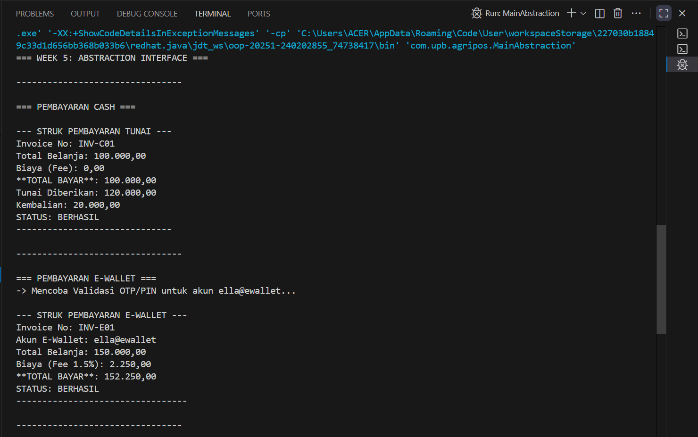

# Laporan Praktikum Minggu 5 
Topik: Abstraction (Abstract Class & Interface)
## Identitas
- Nama  : Cinta Alghumaidatul Affaf
- NIM   : 240202855
- Kelas : 3IKRA

---

## Tujuan
- Mahasiswa mampu menjelaskan perbedaan abstract class dan interface.
- Mahasiswa mampu mendesain abstract class dengan method abstrak sesuai kebutuhan kasus.
- Mahasiswa mampu membuat interface dan mengimplementasikannya pada class.
- Mahasiswa mampu menerapkan multiple inheritance melalui interface pada rancangan kelas.
- Mahasiswa mampu mendokumentasikan kode (komentar kelas/method, README singkat pada folder minggu).
---

## Dasar Teori
Abstraksi adalah proses menyederhanakan kompleksitas dengan menampilkan elemen penting dan menyembunyikan detail implementasi.

 - Abstract class: tidak dapat diinstansiasi, dapat memiliki method abstrak (tanpa badan) dan non-abstrak. Dapat menyimpan state (field).
 - Interface: kumpulan kontrak (method tanpa implementasi konkret). Sejak Java 8 mendukung default method. Mendukung multiple inheritance (class dapat mengimplementasikan banyak interface).
 - Gunakan abstract class bila ada shared state dan perilaku dasar; gunakan interface untuk mendefinisikan kemampuan/kontrak lintas hierarki.

Dalam konteks Agri-POS, Pembayaran dapat dimodelkan sebagai abstract class dengan method abstrak prosesPembayaran() dan biaya(). Implementasi konkritnya: Cash dan EWallet. Kemudian, interface seperti Validatable (mis. verifikasi OTP) dan Receiptable (mencetak bukti) dapat diimplementasikan oleh jenis pembayaran yang relevan.

---

## Langkah Praktikum

1. Membuat struktur folder:

src/main/java/com/upb/agripos/
└── model
    ├── kontrak
    └── pembayaran
└── util


2. Membuat interface kontrak
   - Validatable.java
   - Receiptable.java

3. Membuat abstract class pembayaran
   - Pembayaran.java

4.  Membuat class turunan
   - Cash.java
   - EWallet.java
   - TransferBank.java

5. Membuat class util
   - CreditBy.java

6. Membuat class Main (MainAbstraction.java)
   - Me-run contoh pembayaran menggunakan polymorphism.

7. Memperbaiki error package
   - (dari package main.java.com.upb.agripos → package com.upb.agripos).

6. Melakukan commit
  Contoh commit yang digunakan:
    - "add interface validatable & receiptable"
    - "add pembayaran abstract class"
    - "implement cash & ewallet"
    - "fix package name error in MainAbstraction"
    - "add transfer bank & adjust imports"
---

## Kode Program

```java
// Receiptable.java
package com.upb.agripos.model.kontrak;

public interface Receiptable {
    String cetakStruk();
}
```
```java
// Validatable.java
package com.upb.agripos.model.kontrak;

public interface Validatable {
    boolean validasi(); // misal validasi OTP/ PIN
}
```
```java
// Cash.java
package com.upb.agripos.model.pembayaran;

import com.upb.agripos.model.kontrak.Receiptable;

public class Cash extends Pembayaran implements Receiptable {
    private double tunai;

    public Cash(String invoiceNo, double total, double tunai) {
        super(invoiceNo, total);
        this.tunai = tunai;
    }

    @Override
    public double biaya() {
        return 0.0;
    }

    @Override
    public boolean prosesPembayaran() {
        return tunai >= totalBayar(); // sederhana: cukup uang tunai
    }

     @Override
    public String cetakStruk() {
        boolean berhasil = prosesPembayaran();
        String status = berhasil ? "BERHASIL" : "GAGAL (Tunai Kurang)";
        double kembalian = berhasil ? (tunai - totalBayar()) : 0.0;
        
        return "\n--- STRUK PEMBAYARAN TUNAI ---\n" +
               "Invoice No: " + invoiceNo + "\n" +
               "Total Belanja: " + String.format("%,.2f", total) + "\n" +
               "Biaya (Fee): " + String.format("%,.2f", biaya()) + "\n" +
               "**TOTAL BAYAR**: " + String.format("%,.2f", totalBayar()) + "\n" +
               "Tunai Diberikan: " + String.format("%,.2f", tunai) + "\n" +
               "Kembalian: " + String.format("%,.2f", kembalian) + "\n" +
               "STATUS: " + status +
               "\n------------------------------";
    }
}

```
```java
// EWallet.java
package com.upb.agripos.model.pembayaran;

import com.upb.agripos.model.kontrak.Validatable;
import com.upb.agripos.model.kontrak.Receiptable;

public class EWallet extends Pembayaran implements Validatable, Receiptable {
    private String akun;
    private String otp; // sederhana untuk simulasi
    private boolean isProcessed = false; // <-- FIELD BARU untuk Status
    private boolean statusPembayaran = false; // <-- FIELD BARU untuk Hasil Proses

    public EWallet(String invoiceNo, double total, String akun, String otp) {
        super(invoiceNo, total);
        this.akun = akun;
        this.otp = otp;
    }

    @Override
    public double biaya() {
        return total * 0.015; // 1.5% fee
    }

    @Override
    public boolean validasi() {
         System.out.println("-> Mencoba Validasi OTP/PIN untuk akun " + akun + "...");
        return otp != null && otp.length() == 6; 
    }

     @Override
    public boolean prosesPembayaran() {
        // Hanya proses jika belum pernah diproses
        if (!isProcessed) {
            this.statusPembayaran = validasi(); // Jalankan validasi dan simpan hasilnya
            this.isProcessed = true;
        }
        return this.statusPembayaran; // Kembalikan status yang sudah disimpan
    }

    @Override
    public String cetakStruk() {
        // mengambil status yang sudah tersimpan, sehingga tidak ada panggilan prosesPembayaran() yang menjalankan validasi lagi.
        String status = statusPembayaran ? "BERHASIL" : "GAGAL (Validasi Gagal)";

        return "\n--- STRUK PEMBAYARAN E-WALLET ---\n" +
               "Invoice No: " + invoiceNo + "\n" +
               "Akun E-Wallet: " + akun + "\n" +
               "Total Belanja: " + String.format("%,.2f", total) + "\n" +
               "Biaya (Fee 1.5%): " + String.format("%,.2f", biaya()) + "\n" +
               "**TOTAL BAYAR**: " + String.format("%,.2f", totalBayar()) + "\n" +
               "STATUS: " + status +
               "\n---------------------------------";
    }
}

```
```java
//Pembayaran.java
package com.upb.agripos.model.pembayaran;

public abstract class Pembayaran {
    protected String invoiceNo;
    protected double total;

    public Pembayaran(String invoiceNo, double total) {
        this.invoiceNo = invoiceNo;
        this.total = total;
    }

    public abstract double biaya();               // fee/biaya tambahan
    public abstract boolean prosesPembayaran();   // proses spesifik tiap metode

    public double totalBayar() {
        return total + biaya();
    }

    public String getInvoiceNo() { return invoiceNo; }
    public double getTotal() { return total; }
}

```
```java
//TransferBank.java
package com.upb.agripos.model.pembayaran;

import com.upb.agripos.model.kontrak.Receiptable;
import com.upb.agripos.model.kontrak.Validatable;


public class TransferBank extends Pembayaran implements Validatable, Receiptable {
    private final double BIAYA_TETAP = 3500.00;
    private String kodeBank;
    private boolean isProcessed = false; // Status apakah proses pembayaran sudah dijalankan
    private boolean statusPembayaran = false; // Hasil dari proses/validasi yang tersimpan


    public TransferBank(String invoiceNo, double total, String kodeBank) {
        super(invoiceNo, total);
        this.kodeBank = kodeBank;
    }

    @Override
    public double biaya() {
        return BIAYA_TETAP; // Biaya tetap Rp3.500,00
    }

    @Override
    public boolean validasi() {
        // Contoh validasi: kode bank harus 3 digit angka
        boolean valid = kodeBank != null && kodeBank.matches("\\d{3}");
        System.out.println("-> Mencoba Validasi Kode Bank (" + kodeBank + ")... " + (valid ? "BERHASIL" : "GAGAL (Kode Invalid)"));
        return valid; 
    }

    @Override
    public boolean prosesPembayaran() {
        if (!isProcessed) {
            this.statusPembayaran = validasi(); // Jalankan validasi dan simpan hasilnya
            this.isProcessed = true;
        }
        return this.statusPembayaran;
    }

    @Override
    public String cetakStruk() {
        // Panggilan prosesPembayaran() di sini akan menjalankan validasi
        boolean berhasil = prosesPembayaran();
        String status = berhasil ? "BERHASIL" : "GAGAL (Validasi Gagal)";

        return "\n--- STRUK PEMBAYARAN TRANSFER BANK ---\n" +
               "Invoice No: " + invoiceNo + "\n" +
               "Kode Bank: " + kodeBank + "\n" +
               "Total Belanja: " + String.format("%,.2f", total) + "\n" +
               "Biaya (Fee Tetap): " + String.format("%,.2f", biaya()) + "\n" +
               "**TOTAL BAYAR**: " + String.format("%,.2f", totalBayar()) + "\n" +
               "STATUS: " + status +
               "\n----------------------------------------";
    }
}

```
```java
//CreditBy.java
package com.upb.agripos.util;

public class CreditBy {
    public static void print(String nim, String nama) {
        System.out.println("Program ini dibuat oleh:");
        System.out.println("NIM   : " + nim);
        System.out.println("Nama  : " + nama);
    }
}

```
```java
//MainAbstraction.java
package com.upb.agripos;

import com.upb.agripos.model.pembayaran.Pembayaran;
import com.upb.agripos.model.pembayaran.Cash;
import com.upb.agripos.model.pembayaran.EWallet;
import com.upb.agripos.model.pembayaran.TransferBank;
import com.upb.agripos.model.kontrak.Receiptable;
import com.upb.agripos.util.CreditBy;

public class MainAbstraction {
    public static void main(String[] args) {

        System.out.println("=== WEEK 5: ABSTRACTION INTERFACE ===");
        System.out.println("\n--------------------------------\n");
        
        // --- 1. CASH (Tunai Cukup) ---
        Pembayaran cash = new Cash("INV-C01", 100000, 120000);
        System.out.println("=== PEMBAYARAN CASH ===");
        cash.prosesPembayaran();
        System.out.println(((Receiptable) cash).cetakStruk());
        
        System.out.println("\n--------------------------------\n");

        // --- 2. E-WALLET (Validasi Berhasil) ---
        Pembayaran ew = new EWallet("INV-E01", 150000, "ella@ewallet", "257845");
        System.out.println("=== PEMBAYARAN E-WALLET ===");
        ew.prosesPembayaran();
        System.out.println(((Receiptable) ew).cetakStruk());

        System.out.println("\n--------------------------------\n");

        // --- 3. TRANSFER BANK (Validasi Berhasil) ---
        Pembayaran transfer = new TransferBank("INV-T01", 75000, "014");
        System.out.println("=== PEMBAYARAN TRANSFER BANK ===");
        transfer.prosesPembayaran();
        System.out.println(((Receiptable) transfer).cetakStruk());

        System.out.println("\n--------------------------------\n");
        
        // --- 4. TRANSFER BANK (Validasi GAGAL) ---
        Pembayaran transferGagal = new TransferBank("INV-T02", 5000, "ABC");
        System.out.println("=== TRANSFER BANK (GAGAL) ===");
        transferGagal.prosesPembayaran();
        System.out.println(((Receiptable) transferGagal).cetakStruk());

        System.out.println("\n--------------------------------\n");

        // --- 5. CreditBy ---
        CreditBy.print("240202855", "Cinta Alghumaidatul Affaf");
    }
}

```
---

## Hasil Eksekusi
(Sertakan screenshot hasil eksekusi program.  

)

---

## Analisis

Pada praktikum ini, program menerapkan konsep abstraction, yaitu menyembunyikan detail implementasi dan hanya menyediakan struktur umum. Kode berjalan dengan alur sebagai berikut:

 1. Class Pembayaran dibuat sebagai abstract class yang menjadi dasar dari semua jenis pembayaran.
Di dalamnya terdapat method abstrak seperti prosesPembayaran() dan biaya() yang wajib diimplementasikan oleh setiap subclass.

 2. Class Cash, EWallet, dan TransferBank merupakan class turunan yang memberikan implementasi spesifik sesuai jenis pembayaran.
Misalnya:
   - Cash langsung memproses pembayaran tanpa validasi.
   - EWallet melakukan validasi OTP dan menghitung biaya admin.
   - TransferBank memvalidasi nomor rekening.

 3. Program juga menggunakan interface:
   - Receiptable → digunakan class yang mencetak struk.
   - Validatable → digunakan untuk proses validasi (OTP atau rekening).

Dengan interface, beberapa class dapat memiliki kemampuan tambahan tanpa harus berada dalam satu hierarki turunan.

 4. Pada metode main, objek dibuat dalam bentuk tipe Pembayaran (polymorphism), tetapi objek nyatanya bisa Cash, EWallet, atau TransferBank.
Ketika prosesPembayaran() dipanggil, Java secara otomatis menentukan implementasi mana yang dijalankan (dynamic dispatch).

**Perbedaan Pendekatan Minggu Ini Dibanding Minggu Sebelumnya** 

- Minggu sebelumnya (Polymorphism)
Fokus pada overriding dan overloading, serta bagaimana objek dengan tipe parent dapat memanggil method milik child menggunakan referensi tunggal.

- Minggu ini (Abstraction)
Fokus pada:

 - Cara mendesain kerangka umum dengan abstract class.
 - Memisahkan kontrak menjadi interface.
 - Menggunakan multiple inheritance melalui interface.
 - Mendesain program lebih modular dan scalable, bukan hanya cara method bekerja.

Jika minggu lalu fokus pada bagaimana objek berperilaku, minggu ini fokus pada bagaimana struktur program dirancang agar fleksibel dan mudah dikembangkan.

**Kendala yang Dihadapi dan Cara Mengatasinya**

1. Error package tidak ditemukan (warna merah di MainAbstraction.java)
Penyebab: package tertulis package main.java.com.upb.agripos; padahal struktur folder sebenarnya hanya com/upb/agripos.
Solusi: mengubah deklarasi menjadi:

```java 
package com.upb.agripos;

```
dan memperbaiki semua import.

2. Error “Unresolved compilation problem” pada CreditBy
Penyebab: method print() tidak cocok atau file tidak terdeteksi karena error sebelumnya pada package.
Solusi: menyesuaikan kembali signature method dan memastikan file berada dalam package yang benar.

3. VSCode tidak mengenali folder atau class (ikon kuning/merah)
Penyebab: struktur folder Java tidak sesuai standar Maven-like yang digunakan plugin.
Solusi:
  - Menyusun folder ke src/main/java/...

  - Menjalankan ulang Java: Clean the Java Language Server.

4. Import tidak terbaca pada class Cash/EWallet/TransferBank
Solusi: memastikan semua class berada dalam package com.upb.agripos.model.pembayaran dan mengimport interface dari kontrak.

---

## Kesimpulan

 Pada praktikum minggu ke-5 ini, konsep abstraction berhasil diterapkan melalui penggunaan abstract class dan interface pada sistem pembayaran AgriPOS. Abstract class digunakan untuk menyimpan struktur dasar dan perilaku umum dari semua jenis pembayaran, sementara interface digunakan sebagai kontrak tambahan seperti validasi dan pencetakan struk. Pendekatan ini membuat kode lebih rapi, modular, dan mudah dikembangkan.

 Dengan abstraction, setiap jenis pembayaran (Cash, EWallet, TransferBank) dapat memiliki implementasi berbeda sesuai kebutuhan tanpa mengubah struktur utama program. Selain itu, penggunaan multiple inheritance melalui interface memberikan fleksibilitas dalam memberikan kemampuan tambahan kepada class tertentu.

 Dari praktikum ini, dapat disimpulkan bahwa abstraction tidak hanya menyederhanakan desain, tetapi juga meningkatkan skalabilitas dan maintainability program — terutama pada proyek besar seperti simulasi sistem POS. Kendala terkait struktur package, import class, dan error kompilasi dapat diatasi dengan memahami penempatan class dan aturan package pada Java.

---

## Quiz

1. **Jelaskan perbedaan konsep dan penggunaan abstract class dan interface.**

**Jawaban:**

Abstract class adalah class yang tidak dapat diinstansiasi dan dapat berisi kombinasi antara method abstrak (tanpa implementasi) dan method konkret (memiliki implementasi). Abstract class juga bisa memiliki field untuk menyimpan state atau data. Abstract class digunakan ketika beberapa class memiliki struktur dasar dan perilaku bersama.

Interface adalah kumpulan kontrak yang berisi method tanpa implementasi (kecuali default method). Interface tidak dapat menyimpan state (hanya konstanta). Satu class dapat mengimplementasikan banyak interface. Interface digunakan untuk mendefinisikan kemampuan tambahan yang bisa dimiliki oleh banyak class berbeda tanpa harus berada pada satu hierarki.

2. **Mengapa multiple inheritance lebih aman dilakukan dengan interface pada Java?**

**Jawaban:**

Multiple inheritance dengan interface lebih aman karena interface tidak membawa state (data/field yang bisa berubah), sehingga tidak menimbulkan konflik pewarisan seperti pada multiple inheritance tradisional.

Pada pewarisan class ganda (seperti di C++), dua class induk bisa memiliki field atau implementasi method yang sama, sehingga terjadi diamond problem. Java menghindari masalah ini dengan hanya memperbolehkan multiple inheritance melalui interface karena interface hanya menyediakan kontrak metode yang harus diimplementasikan oleh class anak. 

3. **Pada contoh Agri-POS, bagian mana yang paling tepat menjadi abstract class dan mana yang menjadi interface? Jelaskan alasannya.**

**Jawaban:**

 - Abstract class yang tepat:
 Pembayaran → Karena semua jenis pembayaran memiliki struktur dasar yang sama: invoiceNo, total, metode totalBayar(), dan prosesPembayaran(). Ada state (data) yang harus disimpan dan diwariskan, sehingga sangat cocok menggunakan abstract class.

 - Interface yang tepat:

    - Validatable → Karena tidak semua pembayaran membutuhkan proses validasi (misalnya Cash tidak memerlukan OTP). Jadi validasi dibuat sebagai kemampuan tambahan yang opsional.

    - Receiptable → Karena semua pembayaran boleh mencetak struk, tapi formatnya berbeda-beda. Interface cocok karena hanya mendefinisikan kontrak cetakStruk(), implementasinya bebas.

Dengan pembagian ini, desain menjadi fleksibel, modular, dan mengikuti prinsip OOP yang baik.